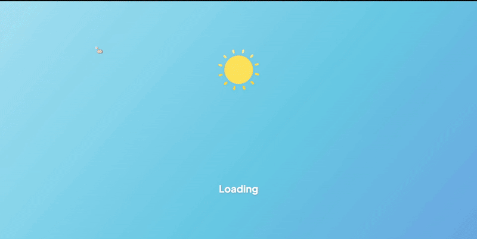
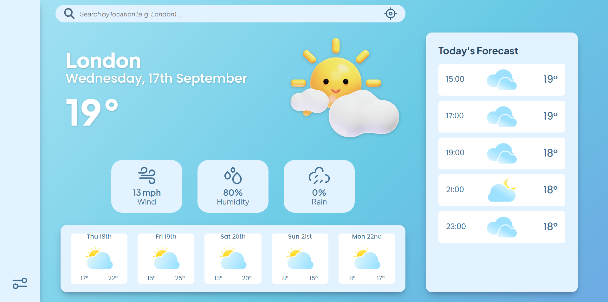
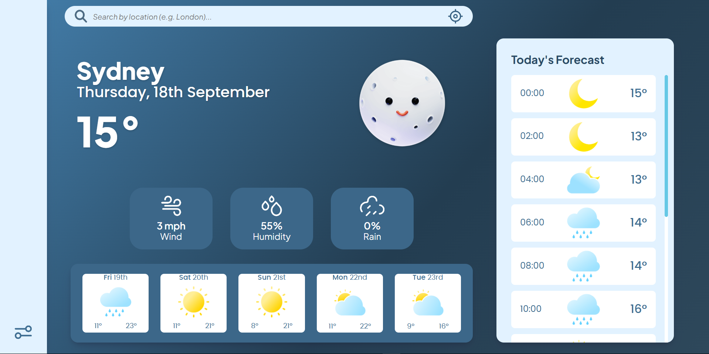
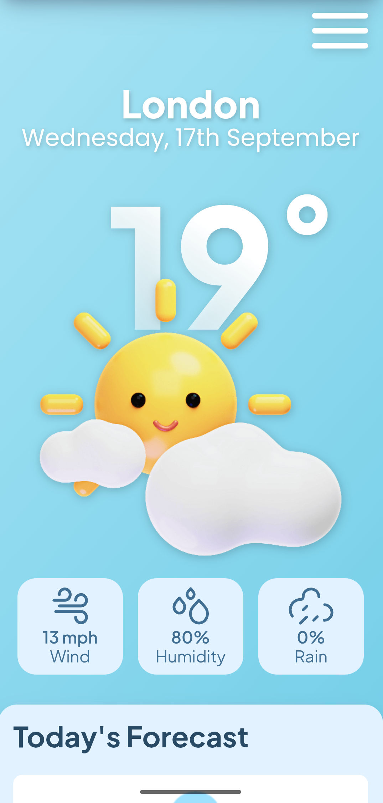
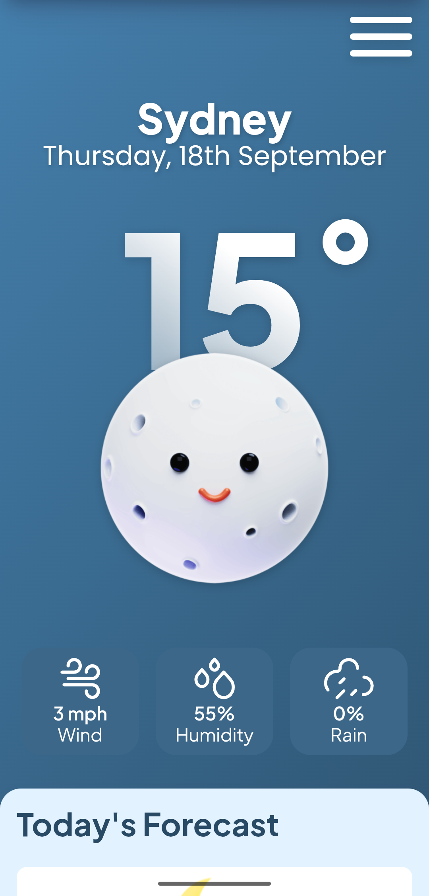

# Weather App
A colorful web-based application to view real-time weather data from around the globe.

🌐 [View Live Demo](https://zoieboyd.github.io/weather-app/) | 🎨 [View Figma Design Mockup](https://www.figma.com/design/OmjFS9xxUZnGE5xoWucLV7/Weather-App?node-id=0-1&p=f&t=aOSgGDqqiZ7Qm8Ez-0)

## Features
- Manual location searching
- Automatic location searching using user location permissions
- Temperature scale toggle (Celsius to Fahrenheit)
- Time system toggle (12 hour to 24 hour)
- Responsive for both desktop and mobile screens
- Dynamic visual themes representitive of day and night

## Potential Improvements
- Improve responsiveness on tablet screens
- localStorage implementation to preserve settings data batween user sessions
- Additional data (e.g. UV index, weather warnings etc) 

## Technologies Used
### Languages
- JavaScript
- HTML
- CSS
### Design
- Figma
### Libraries
- date-fns
### Module Bundler
- Webpack
### APIs
- Virtual Crossing Weather
- Big Data Cloud Reverse Geocode Client
### Other
- Prettier
- ESLint
- Normalize.css

## Gallery

*Desktop Day Theme Preview*

*Desktop Night Theme Preview*

| | |
| :---: | :---: |
 | 
*Mobile Day Theme Preview* | *Mobile Night Theme Preview*

## Credit
- [3D Weather Icons](https://dribbble.com/shots/16526395-3D-Weather-Icons) by [Mikołaj Niżnik](https://dribbble.com/mniznik)
- [Weather Icons Pack v1.1](https://dribbble.com/shots/16445086--Weather-Icons-Pack-v1-1) by [Taha Lahouti](https://dribbble.com/TahaTH)
- [Scorcher Weather Icon Pack](https://dribbble.com/shots/23959836-Scorcher-Weather-icon-pack-NEW) by [Majid Manavi](https://dribbble.com/majidart73)
- [Error Icon](https://www.svgrepo.com/svg/447994/error) by [Moneytree](https://www.svgrepo.com/author/moneytree/)
- [Settings Icon](https://staging.svgrepo.com/svg/471876/settings-04), Location Icon by [SVG Repo](https://staging.svgrepo.com/)

## Assignment Instructions
[Instructions provided by The Odin Project](https://www.theodinproject.com/lessons/node-path-javascript-weather-app)
1. Set up a blank HTML document with the appropriate links to your JavaScript and CSS files.

2. Write the functions that hit the API. You’re going to want functions that can take a location and return the weather data for that location. For now, just console.log() the information.

3. Write the functions that process the JSON data you’re getting from the API and return an object with only the data you require for your app.

4. Set up a form that will let users input their location and will fetch the weather info (still just console.log() it).

5. Display the information on your webpage!
   - While you don’t have to, if you wish to display weather icons then there can be a lot of them to import, so have a look at the [dynamic import() function](https://developer.mozilla.org/en-US/docs/Web/JavaScript/Reference/Operators/import). Unlike plain template strings without an import, [Webpack can read dynamic imports](https://webpack.js.org/api/module-methods/#dynamic-expressions-in-import) and still bundle all the relevant assets.

6. Add any styling you like!

7. Optional: add a ‘loading’ component that displays from the time the form is submitted until the information comes back from the API. Use DevTools to simulate network speeds.

8. Push that baby to GitHub and share your solution below!

